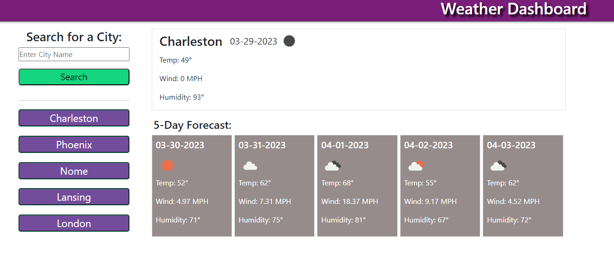

# Weather-Dashboard

[Link to the Web App](https://ds055.github.io/weather-dashboard/)

## Description
An interactive weather forecasting site/app that allows users to find current and forecasted weather for a specific city. 

## Screenshot

## Installation
N/A

## Usage
* Users will arrive at the website--perhaps discovered via a search engine.
* The site will load with Nashville as the default city, for which one can see the current weather and forecasted weather over the next five days. 
* Users may change the designated city by typing in the city name in the search bar and clicking the search button or pressing the enter key. 
* If the city is found, the on-page data will update reflecting weather for the given city. 
* Furthermore, a successful search will add this location to a list of up-to five previously viewed cities.
* If the user clicks on one of the previously viewed cities, the weather data will update to reflect that municipality. 
* If the list is full, the earliest conducted search will be removed from the list. 
* In the event the city doesn't exist or can't be found, the user will be notified as such in the search bar. 

## License
Please refer to the license in the repo.

- - -